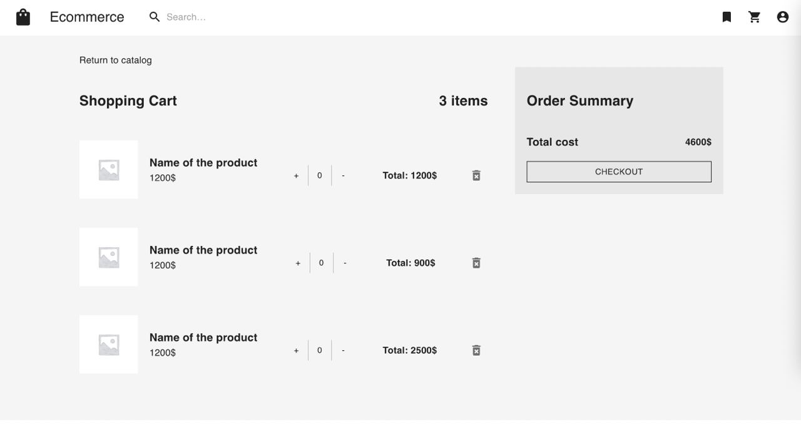

# E-commerce Rest API

API for web stores to sell different types of products. Integrated with payment system Stripe. Also has admin dashboard.



### [Swagger API documentation](https://app.swaggerhub.com/apis-docs/paw1a/E-commerce)

# Contents

1. [Run](#Run)
2. [API](#API)
3. [Implementation](#Implementation)

# Run

To run application you need:
- docker-compose
- .env file

## Env configuration

To run API locally you should create your own .env file in the root directory or rename `.env-example` to `.env`  
Example `.env`:

```env
HOST=localhost
PORT=8080

STRIPE_KEY=<your stripe key>

JWT_SECRET=jwtSecret

DB_NAME=ecommerce
DB_URI=mongodb://mongo:27017
DB_USERNAME=
DB_PASSWORD=

TEST_DB_NAME=ecommerce-test
TEST_DB_URI=mongodb://localhost:27017
TEST_DB_USERNAME=
TEST_DB_PASSWORD=

REDIS_URI=redis:6379
```

## Local run

```
make run
```

or

```
docker-compose up
```

Run test data generation for MongoDB

```
make init
```

Run frontend only

```
docker-compose up frontend
```

# API

Base url: `<host>:8080/api/v1/`

API documentation can be found [here](https://app.swaggerhub.com/apis-docs/paw1a/E-commerce)

# Implementation

- REST API
- Clean architecture design
- Using MongoDB as a main data storage
- Using Redis for cache and user session storage
- Env based application configuration
- Automatically generated Swagger API docs
- Run with docker-compose
- Full automated CI/CD process
- Configured deploy to AWS
- React.js frontend (*in progress*)
- Stripe API payment integration

### Project structure

```
.
├── .bin            // app binary files
├── .data           // directory to store local db data
├── .github         // github actions ci/cd directory
├── cmd             // entry point
├── db              // db generation scripts for mongo
├── deploy          // deploy docker files 
├── docs            // swagger docs and readme images
├── frontend        // react.js app directory
├── internal
│   ├── app         // main application package
│   ├── config      // config loading utils
│   ├── delivery    // http handlers layer
│   ├── domain      // all business entities and dto's
│   ├── repository  // database repository layer
│   └── service     // business logic services layer
├── pkg
│   ├── auth        // jwt auth utils
│   ├── database    // database connection utils
│   ├── logging     // logger configuration
│   └── payment     // payment service configuration
└─
```

# Diagram

